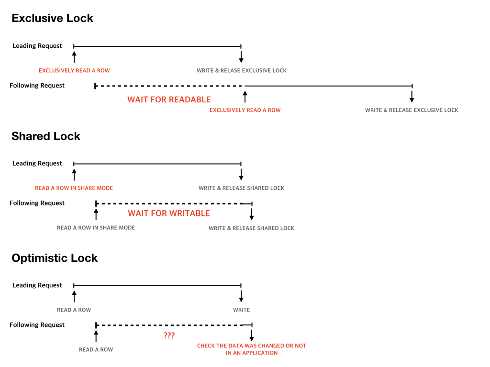
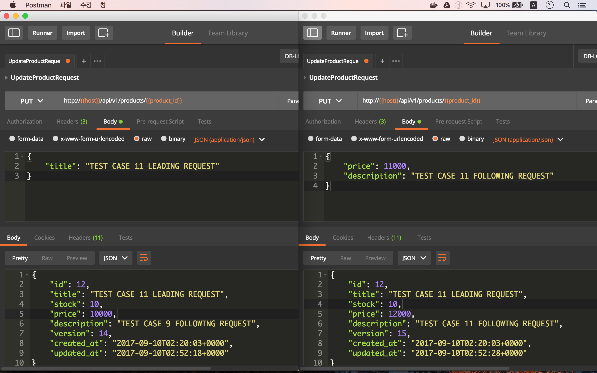

# 데이터베이스 잠금(동시성 문제)을 실험하기 위한 프로젝트

선점 잠금(Pessimistic Lock)과 비선점 잠금(Optimistic Lock)을 실험하기 위한 프로젝트입니다. 선점 잠금은 데이터베이스 레벨에서 지원하는 잠금 기능이며, 비선점 잠금은 애플리케이션 레벨에서 직접 구현해야 하는 잠금 기능입니다. 

선점 잠금은 다시 독점적 잠금(Exclusive Lock)과 공유된 잠금(Shared Lock)으로 구분됩니다. 

독점적 잠금이란 프로세스 A가 데이터베이스의 레코드를 업데이트할 목적으로 조회하면서 업데이트가 끝날 때까지 조회한 레코드를 잠궈 두는 것을 말합니다. 동시에 다른 프로세스 B가 같은 레코드에 대해 잠금을 구하고자 하면 A가 선점한 잠금이 풀릴 때까지 레코드를 조회하거나 업데이트할 수 없으며, A의 업데이트가 끝나면 그제서야 업데이트된 레코드를 B가 얻을 수 있습니다. 

> 가령, 재고가 한 개 남은 어떤 제품을 사용자 A와 B가 동시에 구매하는 상황을 가정해 볼 수 있습니다. A가 구매하면서 시스템이 재고 수량이 0으로 바뀌면, 사용자 B는 구매할 수 없어야 합니다. 

공유된 잠금모드를 이용하면 프로세스 A가 잠근 레코드의 잠금이 풀리기 전일지라도, 프로세스가 해당 레코드에 대해 쓰기만 안될 뿐 읽을 수는 있습니다. 

이 예제에서는 레코드를 선점한 애플리케이션 프로세스가 모든 작업을 완료하는데 10초가 걸리는 상황을 시뮬레이션하고 있습니다. 독점적 잠금이라면, 다른 프로세스는 해당 레코드를 읽지도 못하는 상태가 되며, 이는 해당 레코드에 대한 조회 요청이 많은 서비스라면 조회 성능에 상당한 영향을 줄 수 있습니다.  

> 가령, 재고가 한 개 남은 어떤 제품을 구매하기 위해 사용자 A의 구매 프로세스가 잠금을 얻었다고 가정해보죠. 사용자 A는 구매 프로세스를 끝까지 진행할 수도 있지만, 중간에 변심할 수도 있습니다 사용자가 A가 최종 구매 결정할 때까지, 다른 사용자는 해당 제품을 계속 조회할 수 있어야 합니다.

비 선점 잠금이란 레코드를 업데이트하는 순간에 업데이트 가능성을 판단하는 방법입니다. 사용자가 A와 B가 제품 구매를 위해 조회한 레코드 버전이 1인데, 사용자 B가 먼저 구매하면서 레코드의 버전이 2로 바뀌었다면, 사용자 A는 예외 응답을 받게 됩니다. 아래 SQL 문장처럼 데이터베이스 레코드를 업데이트할 때 조회한 레코드의 버전을 조건절에 포함하여 구현합니다. [Wikipedia: Optimistic concurrency control](https://en.wikipedia.org/wiki/Optimistic_concurrency_control)

```sql
UPDATE products SET stock = 0, version = version + 1 WHERE version = 1 AND id = 1
```

> 데이터베이스 레벨에서 순식간에 모든 프로세스가 처리된다면 모두가 행복하겠지만, 현실에서는, 특히 웹 서비스에서는 관리자 A가 제품 변경을 위해 어떤 제품을 조회하고 한 시간 동안 그 제품의 속성을 변경하고 있다고 가정해 보죠. 그 와중에 관리자 B가 같은 제품의 가격을 1만원에서 1.2만원으로 변경하고 반영했다고 하죠. 그런데 관리자 A의 변경에도 여러 가지 변경 내용 중에 제품 가격을 1만원에서 1.1만원으로 변경하는 수정이 포함되어 있다고 가정해 보겠습니다. 관리자 A의 변경은 관리자 B의 변경을 덮어 써 버립니다. 이때 비선점 잠금이 있다면, 관리자 B의 변경 내용이 덮어써지는 것을 막을 수 있습니다.

아래 그림은 제가 이해한 내용입니다. 틀릴 수 있습니다. 오류가 있으면, 깃허브 이슈로 지적해 주세요.



이 실험 프로젝트에서는 라라벨 프레임워크와 Pseudo DDD(Domain Driven Design) 설계를 적용하여, 선점 잠금과 비선점 잠금을 구현하고 있습니다.

~~이 실험 프로젝트를 진행한 후, 알게된 엄청난 사실은... 다음 링크에서 확인해 주세요.~~
~~http://stackoverflow.com/questions/15872326/php-mysql-does-mysql-auto-lock-rows-when-updating~~

## 1. 프로젝트 설치

프로젝트를 복제하고 컴포저 컴포넌트를 설치합니다.

```bash
~ $ git clone git@github.com:appkr/db-lock-poc.git && cd db-lock-poc
~/db-lock-poc $ composer install
~/db-lock-poc $ cp .env.example .env
~/db-lock-poc $ php artisan key:generate
```

`.env` 파일을 열어 MySQL 접속 정보를 설정합니다.

```bash
# .env

DB_CONNECTION=mysql
DB_HOST=127.0.0.1
DB_PORT=3306
DB_DATABASE=db_lock_poc
DB_USERNAME=homestead
DB_PASSWORD=secret
# ...
```

> [OPTIONAL] 미리 준비된 LAMP Docker 스택을 실행합니다.
>
> ```
> ~/db-lock-poc $ docker build -t l5app .
> ~/db-lock-poc $ docker run -d \
>     --name db-lock-poc \
>     -v `pwd`:/var/www/html \
>     -v <MYSQL_DATA_DIR_ON_HOST_MACHINE>:/var/lib/mysql \
>     -p 80:80 \
>     -p 3306:3306 \
>     -p 9001:9001 \
>     -p 6379:6379 \
>     -p 10000:10000 \
>     l5app
> ```

데이터베이스 스키마를 초기화하고, 테스트 데이터를 생성합니다.

```bash
~/db-lock-poc $ php artisan migrate --seed
```

> **IMPORTANT NOTICE on 2017-09-09** 이 프로젝트를 만들고 최초 실험할 때 라라벨 내장 웹서버를 사용했었습니다. `SELECT ... FOR UPDATE`(==`lockForUpdate()`) SQL 문장 없이도, 같은 레코드에 대해 포스트맨에서 보낸 요청 A가 끝나고 나서야, 거의 동시에 실행한 요청 B가 처리되는 것을 확인했습니다.
>
> 하지만 사실이 아니었습니다. 이는 **라라벨 내장 웹 서버가 싱글 프로세스만 사용하기 때문이었습니다.** 웹 서버 레벨에서 A 요청에 대한 응답을 완전히 내보내고 나서야 요청 B를 처리하기 시작했기 때문에, 마치 요청 A에 의해 MySQL Row가 잠기고 업데이트가 모두 끝난 후, 요청 B가 요청 A에 의해 업데이트된 Row를 조회하고 업데이트하는 것 같은 환상을 불러일으켰습니다.
>
> 따라서, 이 **실험은 반드시 다중 프로세스를 지원하는 웹 서버에서 해야 합니다.**

### 1.1. 살펴볼 주요 코드


```php
<?php // app/Http/Controllers/ProductController.php

class ProductController extends Controller
{
    public function update(UpdateProductRequest $request, int $productId)
    {
        DB::beginTransaction();

        try {
            // [잠금 없음] Row를 잠그지 않고 조회합니다.
            $product = $this->productRepository->findById($productId);

            // [독점적 선점잠금] SELECT ... FOR UPDATE
            // Row를 조회하고 잠급니다. 다른 프로세스는 해당 Row를 읽을 수 없습니다.
            $product = $this->productRepository->findByIdWithExclusiveLock($productId);

            // [공유된 선점잠금] SELECT ... LOCK IN SHARE MODE
            // Row를 조회하고 잠금니다. 다른 프로세스는 해당 Row를 읽을 수 있으나 변경할 수 없습니다.
            $product = $this->productRepository->findByIdWithSharedLock($productId);

            // [비선점잠금]
            // 조회시점 대비 다른 프로세스에의해 데이터가 이미 변경되었는지 확인한 후 변경합니다.
            // @see core/Myshop/Application/Service/ProductService.php: 42
            // @see core/Myshop/Infrastructure/Eloquent/EloquentProductRepository.php: 56

            // 시간이 오래 걸리는 작업을 시뮬레이션하기 위해 강제로 10초 지연을 줬습니다.
            sleep(10);

            $product = $this->productService->modifyProduct(
                $product, $request->getProductDto()
            );

            DB::commit();
        } catch (Exception $e) {
            DB::rollBack();
            throw $e;
        }

        return json()->withItem($product, new ProductTransformer);
    }
}
```

```php
<?php // core/Myshop/Application/Service/ProductService.php

class ProductService
{
    public function modifyProduct(Product $product, ProductDto $dto)
    {
        // Cache current version before being changed
        $retrievedVersion = $product->version;

        // For HTTP PUT safety
        $product->title = $dto->getTitle() ?: $product->title;
        // For Optimistic Lock
        $product->version += 1;

        $this->productRepository->save($product, $retrievedVersion);

        return $product->fresh();
    }   
}
```

```php
<?php // core/Myshop/Infrastructure/Eloquent/EloquentProductRepository.php

class EloquentProductRepository implements ProductRepository
{
    public function findById(int $id) : Product
    {
        return Product::findOrFail($id);
    }

    public function findByIdWithExclusiveLock(int $id): Product
    {
        return Product::lockForUpdate()->findOrFail($id);
    }

    public function findByIdWithSharedLock(int $id): Product
    {
        return Product::sharedLock()->findOrFail($id);
    }

    public function save(Product $product, int $version = null) : void
    {
        $this->checkVersionMatch($product, $version);
        $product->push();
    }

    private function checkVersionMatch(Product $product, int $version = null)
    {
        if ($version && $product->fresh()->version !== $version) {
            throw new OptimisticLockingFailureException;
        }
    }
}
```

## 2. 테스트

포스트맨 A, B 두 개를 이용하여, `UpdateProductRequest` 요청을 순차적으로 실행합니다. 선점한 프로세스 A가 끝나고 DB 잠금이 풀리면, 다음 프로세스 B를 처리하는 것을 확인합니다.
 
- 포스트맨 콜렉션 : https://www.getpostman.com/collections/af29606934f604e83ec2
- 포스트맨 환경 : https://raw.githubusercontent.com/appkr/db-lock-poc/master/docs/DB-LOCK-POC.postman_environment.json



## 3. 테스트 결과

테스트를 위한 벡터는 다음과 같습니다.

a. NO LOCK
b. EXCLUSIVE LOCK
c. SHARED LOCK
d. OPTIMISTIC LOCK
e. TRANSACTION

### 3.1. 테스트 케이스 및 관찰 결과

첫번째 프로세스를 `Leading Request(A)`, 바로 다음에 시작한 프로세스를 `Following Request(B)`라 부르겠습니다. 

Test Cases(TC)|Observations
---|---
`1. a`|`B`가 `A`의 변경 내용을 덮어 씀
`2. b`|(이해할 수 없는 결과인데) `B`가 `A`의 변경 내용을 덮어 씀
`3. c`|TC#2와 같은 결과
`4. a+d`|비선점 잠금이 작동하므로 예외를 발생시켜, `A`의 변경 내용을 보호함
`5. a+e`|TC#1과 같은 결과
`6. b+e`|`A`와 `B`의 변경 내용이 모두 보호됨
`7. c+e`|데드락 발생
`8. a+d+e`|TC#1과 같은 결과
`9. b+d`|TC#4와 같은 결과
`10. c+d`|TC#4와 같은 결과
`11. b+d+e`|TC#6과 같은 결과
`12. c+d+e`|TC#7과 같은 결과

### 3.2. 테스트 디테일

`Leading Request(A)`, `Following Request(B)`의 응답을 순차적으로 기록해 둡니다. `A`는 제품의 `"title"` 속성만 변경하고, `B`는 `"price"`와 `"description"` 속성을 변경합니다. 비선점 잠금의 작동 여부와 무관하게 `"version"` 속성은 항상 1씩 더하도록 하고 있습니다. `A`와 `B`간의 시차는 `"updated_at"` 속성의 값으로 확인할 수 있습니다.

[링크](OBSERVATIONS.md)에서 결과표를 볼 수 있습니다.

---

# 라라벨에 스웨거 적용 테스트를 위한 프로젝트

이 프로젝트에 [스웨거(Swagger)](https://swagger.io/) 적용 가능성을 검토하고 있습니다.

- API 클라이언트 라이브러리: https://github.com/appkr/swagger-poc-api
- PHP API 클라이언트 예제 프로젝트: https://github.com/appkr/swagger-api-client-poc

## Sponsor

[Jetbrains](https://www.jetbrains.com/) 사에서 IntelliJ IDE를 제공해주셨습니다.

